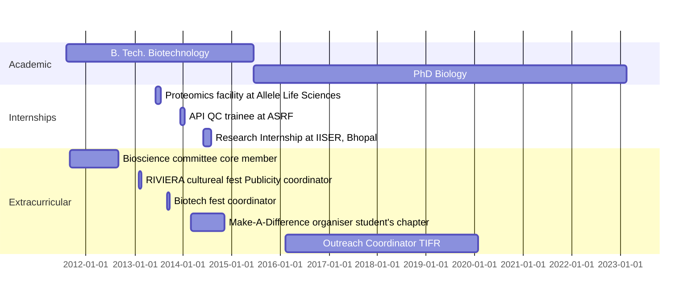

---
# An instance of the Experience widget.
# Documentation: https://wowchemy.com/docs/page-builder/
widget: experience

# This file represents a page section.
headless: true

# Order that this section appears on the page.
weight: 40

title: Experience
subtitle:

# Date format for experience
#   Refer to https://wowchemy.com/docs/customization/#date-format
date_format: Jan 2006

# Experiences.
#   Add/remove as many `experience` items below as you like.
#   Required fields are `title`, `company`, and `date_start`.
#   Leave `date_end` empty if it's your current employer.
#   Begin multi-line descriptions with YAML's `|2-` multi-line prefix.
experience:
  - title: PhD candidate
    company: TIFR
    company_url: 'https://tifr.res.in/'
    company_logo: tifr
    location: Mumbai
    date_start: '2015-07-29'
    date_end: ''
    description: |2-
        Responsibilities include:

        * Teaching Assistant for Advanced Neuroscience course (2018)
        * Outreach coordinator for the department (2016-2020)

  - title: B. Tech Biotechnology
    company: VIT University
    company_url: 'https://vit.ac.in/'
    company_logo: VIT
    location: Vellore
    date_start: '2011-08-05'
    date_end: '2015-06-16'
    description: |2-
        Responsibilities include:

        * Member of the youth organization Make A Difference (MAD) 2014
        * Discipline committee Co-coordinator, RIVIERA 2013-2014 (International sports and Cultural Carnival)
        * BIOSUMMIT 2013 Volunteer (Biotechnological fest)
        * SABEST member for the year 2011-2012 (Core committee for our school)

  - title: Trainee
    company: ASRF
    company_url: 'https://www.asgbiochem.com'
    location: Gurgaon, India
    date_start: '2013-12-06'
    date_end: '2014-01-03'
    description: |2-
        Responsibilities include:

        * Active Pharmaceutical Ingredient purity testing using near-infrared spectroscopy
        * Report generation of HPLC API samples

design:
  columns: '2'
---

